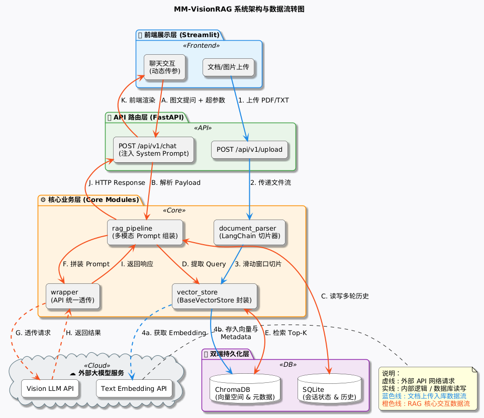
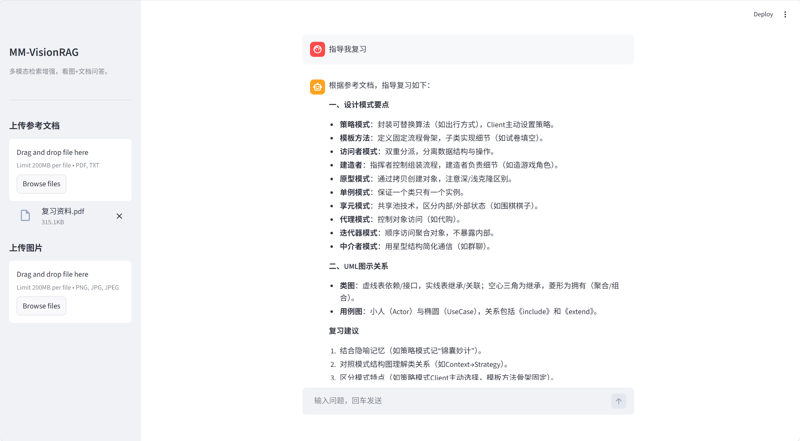

# MM-VisionRAG

多模态 RAG 后端：上传文档和图片后，用向量检索 + 多轮历史拼好 prompt，再调视觉大模型回答，减轻幻觉。支持接口里传 `system_prompt`、`top_k` 等，方便做文档问答、模拟面试之类的衍生。

技术栈：FastAPI、ChromaDB、SQLite、LangChain（只用了文档加载和分块）、Pydantic、Streamlit。

---

## 做什么

- **文档入库**：支持 txt / pdf，LangChain 加载 + 按字符分块，进 ChromaDB，带 source 等 metadata，检索时可以按文档筛。
- **多轮对话**：对话历史存 SQLite，不依赖 LangChain 的记忆；检索到的片段、历史、当前问题在后端拼成 prompt，再交给大模型，整条链自己控。
- **可配置**：请求里可以带 `system_prompt`、`top_k`，不在代码里写死人设，适合当通用中台用。

---

## 架构

架构图用 `assets/architecture.puml` 导出成 PNG 放到 `assets/architecture.png` 即可。实线是内部/数据库，虚线是调外部 API。



- 前端：Streamlit（上传 + 聊天）
- 后端：FastAPI + Pydantic
- 存储：SQLite 存会话和消息，ChromaDB 存向量
- 主流程：document_parser → vector_store → rag_pipeline（历史 + 检索 + 拼 prompt）→ wrapper 调 VLM

设计上：SQLite 管确定型状态，Chroma 管语义检索，各干各的。RAG 主流程没用 LangChain 的 Chain/Agent，检索、重试、拼 prompt 都在自己代码里，方便排查和改。文档解析那块用 LangChain 的 Loader 和 RecursiveCharacterTextSplitter，省事。

---

## 怎么跑

**环境**：Python 3.10+，`pip install -r requirements.txt`。

**密钥**：在项目根建 `.env`，写上 `API_KEY`、`API_URL`、`MODEL_NAME`（例如走硅基流动就填对应接口地址和模型名）。`.env` 已在 .gitignore 里，别提交。

**起服务**：

```bash
uvicorn src.api:app --reload --host 0.0.0.0 --port 8000
```

另开一个终端起前端：

```bash
streamlit run app.py
```

浏览器打开 Streamlit 给的地址（一般是 8501）。侧栏传 txt/pdf 会走 `/api/v1/upload` 入库，主界面提问走 RAG 聊天。接口文档：<http://127.0.0.1:8000/docs>。

**跑测试**：`python -m pytest tests/ -v`。

---

## 界面



---

## 目录结构

```
MM-VisionRAG/
├── app.py              # Streamlit 前端
├── src/
│   ├── api.py          # FastAPI 路由
│   ├── schemas.py      # 请求/响应模型
│   ├── database.py     # SQLite 会话与历史
│   ├── vector_store.py # ChromaDB 封装
│   ├── document_parser.py  # 文档加载与分块
│   ├── rag_pipeline.py # 历史 + 检索 + prompt 组装
│   ├── wrapper.py      # 调大模型/Embedding 的封装
│   └── config_logging.py
├── data/               # SQLite、Chroma、上传文件
├── tests/
├── assets/
└── requirements.txt
```

---

## 后面可能做的

- 检索：加 Reranker、query 改写，提高召回。
- 性能与安全：Redis 限流、语义缓存（比如 GPTCache），降调用成本和延迟。

---